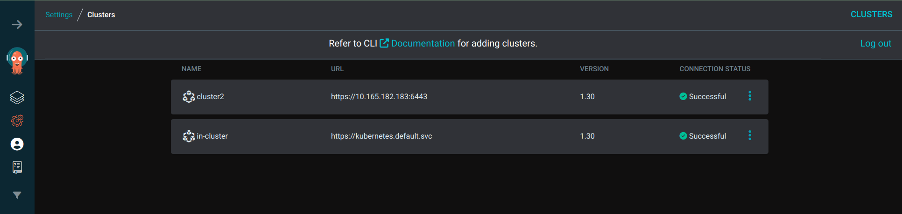
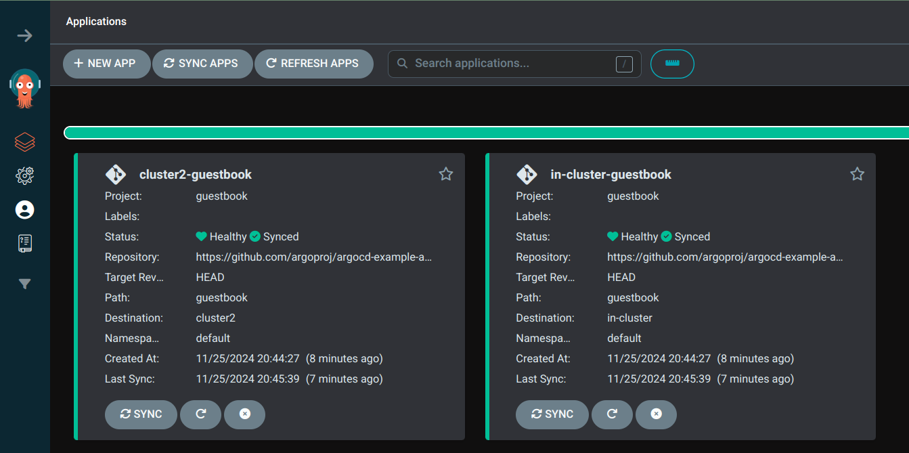

## Using ApplicationSet to deploy to multiple clusters

- Set up an argocd project with the right set of destination clusters, namespace and source repo




- Sample ApplicationSet definition
```
apiVersion: argoproj.io/v1alpha1
kind: ApplicationSet
metadata:
  name: guestbook
spec:
  goTemplate: true
  goTemplateOptions: ["missingkey=error"]
  generators:
  - list:
      elements:
      - cluster: in-cluster
        url: https://kubernetes.default.svc
      - cluster: cluster2
        url: https://10.165.182.183:6443
  template:
    metadata:
      name: '{{.cluster}}-guestbook'
    spec:
      project: guestbook
      source:
        repoURL: https://github.com/argoproj/argocd-example-apps.git
        targetRevision: HEAD
        path: guestbook
      destination:
        server: '{{.url}}'
        namespace: default

```

- How to create an application set
```
ubuntu@master:~$ argocd appset create applicationset.yaml 
ApplicationSet 'guestbook' created
Name:               argocd/guestbook
Project:            guestbook
Server:             {{.url}}
Namespace:          default
Source:
- Repo:             https://github.com/argoproj/argocd-example-apps.git
  Target:           HEAD
  Path:             guestbook
SyncPolicy:         <none>

```

