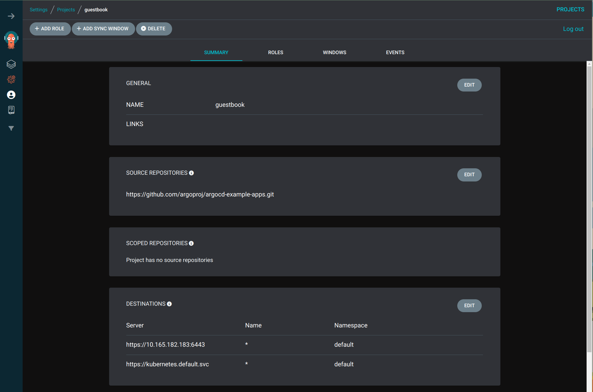

## Installing ArgoCD in k3s
- Based on https://medium.com/@enriqueav1999/install-argocd-in-k3s-with-certresolver-and-traefik-2ab534f40c8f
- Create ArgoCD namespace and apply its CRDs
```
kubectl create namespace argocd
kubectl apply -n argocd -f https://raw.githubusercontent.com/argoproj/argo-cd/stable/manifests/install.yaml
```

## Exposing ArgoCD using traefik
- Disable TLS by editing the configmap and add server.insecure: "true"
- Restart argocd-server
- Create a Traefik ingressroute
```
$ kubectl edit cm argocd-cmd-params-cm -n argocd
$ kubectl get cm argocd-cmd-params-cm -n argocd -o yaml
apiVersion: v1
data:
  server.insecure: "true"
kind: ConfigMap
metadata:
  annotations:
    kubectl.kubernetes.io/last-applied-configuration: |
      {"apiVersion":"v1","kind":"ConfigMap","metadata":{"annotations":{},"labels":{"app.kubernetes.io/name":"argocd-cmd-params-cm","app.kubernetes.io/part-of":"argocd"},"name":"argocd-cmd-params-cm","namespace":"argocd"}}
  creationTimestamp: "2024-11-23T22:50:26Z"
  labels:
    app.kubernetes.io/name: argocd-cmd-params-cm
    app.kubernetes.io/part-of: argocd
  name: argocd-cmd-params-cm
  namespace: argocd
  resourceVersion: "34937"
  uid: b55886b6-8b65-4326-bfd8-c73c63213dc8

$ kubectl rollout restart deployment argocd-server -n argocd
deployment.apps/argocd-server restarted

$ cat argocd.yaml
apiVersion: traefik.containo.us/v1alpha1
kind: IngressRoute
metadata:
  name: argocd-server
  namespace: argocd
spec:
  entryPoints:
    - websecure
  routes:
    - kind: Rule
      match: Host(`argocd.acme.com`)
      priority: 10
      services:
        - name: argocd-server
          port: 80
    - kind: Rule
      match: Host(`argocd.acme.com`) && Header(`Content-Type`, `application/grpc`)
      priority: 11
      services:
        - name: argocd-server
          port: 80
          scheme: h2c
  tls:
    certResolver: default

ubuntu@ocmhub:~$ kubectl apply -f argocd.yaml 
ingressroute.traefik.containo.us/argocd-server created
```
- Edit your /etc/hosts file to contain the entry for the host name you're using
```
andre@cyber:~/workspace/k3s-multipass$ grep argo /etc/hosts
10.165.182.250 mytraefikdashboard.io argocd.acme.com
10.165.182.84 argocd.ocmhub.com
andre@cyber:~/workspace/k3s-multipass$ 
```
- Get the initial password for argo
```
ubuntu@ocmhub:~$ kubectl -n argocd get secret argocd-initial-admin-secret -o jsonpath="{.data.password}" | base64 --decode
xxxxxx
```
- Try invoking the argocd UI
```
andre@cyber:~/workspace/k3s-multipass$ curl -kL https://argocd.ocmhub.com
<!doctype html><html lang="en"><head><meta charset="UTF-8"><title>Argo CD</title><base href="/"><meta name="viewport" content="width=device-width,initial-scale=1"><link rel="icon" type="image/png" href="assets/favicon/favicon-32x32.png" sizes="32x32"/><link rel="icon" type="image/png" href="assets/favicon/favicon-16x16.png" sizes="16x16"/><link href="assets/fonts.css" rel="stylesheet"><script defer="defer" src="main.d18c2027830f979ac445.js"></script></head><body><noscript><p>Your browser does not support JavaScript. Please enable JavaScript to view the site. Alternatively, Argo CD can be used with the <a href="https://argoproj.github.io/argo-cd/cli_installation/">Argo CD CLI</a>.</p></noscript><div id="app"></div></body><script defer="defer" src="extensions.js"></script></html>andre@cyber:~/workspace/k3s-multipass$ 
andre@cyber:~/workspace/k3s-multipass$ 
```
- Use your browser to login as admin, using the generated password, then change it by going to the User Info section

## Install ArgoCD CLI
- Use curl 
```
curl -sSL -o argocd-linux-amd64 https://github.com/argoproj/argo-cd/releases/latest/download/argocd-linux-amd64
sudo install -m 555 argocd-linux-amd64 /usr/local/bin/argocd
rm argocd-linux-amd64
```
- Try logging in via CLI
```
argocd login --insecure --port-forward --port-forward-namespace=argocd --plaintext
```
- Try checking the version
```
ubuntu@ocmhub:~$ argocd --insecure --port-forward --port-forward-namespace=argocd --plaintext version
argocd: v2.13.1+af54ef8
  BuildDate: 2024-11-20T16:54:29Z
  GitCommit: af54ef8db5adfa77a08d4d05b1318a2198084c22
  GitTreeState: clean
  GoVersion: go1.22.9
  Compiler: gc
  Platform: linux/amd64
argocd-server: v2.13.1+af54ef8
  BuildDate: 2024-11-20T15:58:16Z
  GitCommit: af54ef8db5adfa77a08d4d05b1318a2198084c22
  GitTreeState: clean
  GoVersion: go1.23.1
  Compiler: gc
  Platform: linux/amd64
  Kustomize Version: v5.4.3 2024-07-19T16:40:33Z
  Helm Version: v3.15.4+gfa9efb0
  Kubectl Version: v0.31.0
  Jsonnet Version: v0.20.0
ubuntu@ocmhub:~$ 
```
## Registering clusters
- Grab the kubeconfig from each individual k3s cluster to be managed, change the IP address from localhost to their external IP address, and the context and cluster name from default to their corresponding cluster name; for example
```
andre@cyber:~/workspace/k3s-multipass$ multipass transfer ocm1:/etc/rancher/k3s/k3s.yaml ocm1.yaml
andre@cyber:~/workspace/k3s-multipass$ multipass transfer ocm2:/etc/rancher/k3s/k3s.yaml ocm2.yaml
andre@cyber:~/workspace/k3s-multipass$ multipass info ocm1 | grep -i ipv4
IPv4:           10.165.182.196
andre@cyber:~/workspace/k3s-multipass$ multipass info ocm2 | grep -i ipv4
IPv4:           10.165.182.234
andre@cyber:~/workspace/k3s-multipass$ sed -i -e 's/127.0.0.1/10.165.182.196/g' ocm1.yaml
andre@cyber:~/workspace/k3s-multipass$ sed -i -e 's/127.0.0.1/10.165.182.234/g' ocm2.yaml
andre@cyber:~/workspace/k3s-multipass$ 
andre@cyber:~/workspace/k3s-multipass$ sed -i -e 's/default/ocm1/g' ocm1.yaml
andre@cyber:~/workspace/k3s-multipass$ sed -i -e 's/default/ocm2/g' ocm2.yaml


andre@cyber:~/workspace/k3s-multipass$ multipass transfer ocm1.yaml ocmhub:ocm1.yaml
andre@cyber:~/workspace/k3s-multipass$ multipass transfer ocm2.yaml ocmhub:ocm2.yaml
andre@cyber:~/workspace/k3s-multipass$ 
```
- In the argocd hub cluster, merge those cluster configs with the local KUBECONFIG
```

ubuntu@ocmhub:~$ export KUBECONFIG=$KUBECONFIG:ocm1.yaml:ocm2.yaml
ubuntu@ocmhub:~$ kubectl config view
apiVersion: v1
clusters:
- cluster:
    certificate-authority-data: DATA+OMITTED
    server: https://127.0.0.1:6443
  name: default
- cluster:
    certificate-authority-data: DATA+OMITTED
    server: https://10.165.182.196:6443
  name: ocm1
- cluster:
    certificate-authority-data: DATA+OMITTED
    server: https://10.165.182.234:6443
  name: ocm2
contexts:
- context:
    cluster: default
    namespace: argocd
    user: default
  name: default
- context:
    cluster: ocm1
    user: ocm1
  name: ocm1
- context:
    cluster: ocm2
    user: ocm2
  name: ocm2
current-context: default
kind: Config
preferences: {}
users:
- name: default
  user:
    client-certificate-data: DATA+OMITTED
    client-key-data: DATA+OMITTED
- name: ocm1
  user:
    client-certificate-data: DATA+OMITTED
    client-key-data: DATA+OMITTED
- name: ocm2
  user:
    client-certificate-data: DATA+OMITTED
    client-key-data: DATA+OMITTED
ubuntu@ocmhub:~$ 
```
- Register them using argocd CLI
```
ubuntu@ocmhub:~$ argocd --insecure --port-forward --port-forward-namespace=argocd --plaintext cluster add ocm1
WARNING: This will create a service account `argocd-manager` on the cluster referenced by context `ocm1` with full cluster level privileges. Do you want to continue [y/N]? y
INFO[0002] ServiceAccount "argocd-manager" created in namespace "kube-system" 
INFO[0002] ClusterRole "argocd-manager-role" created    
INFO[0002] ClusterRoleBinding "argocd-manager-role-binding" created 
INFO[0002] Created bearer token secret for ServiceAccount "argocd-manager"
Cluster 'https://10.165.182.196:6443' added
ubuntu@ocmhub:~$ 
ubuntu@ocmhub:~$ argocd --insecure --port-forward --port-forward-namespace=argocd --plaintext cluster add ocm2
WARNING: This will create a service account `argocd-manager` on the cluster referenced by context `ocm2` with full cluster level privileges. Do you want to continue [y/N]? y
INFO[0002] ServiceAccount "argocd-manager" created in namespace "kube-system" 
INFO[0002] ClusterRole "argocd-manager-role" created    
INFO[0002] ClusterRoleBinding "argocd-manager-role-binding" created 
INFO[0002] Created bearer token secret for ServiceAccount "argocd-manager" 
Cluster 'https://10.165.182.234:6443' added
ubuntu@ocmhub:~$ 
```
- Check that the clusters are all registered
```
ubuntu@ocmhub:~$ argocd --port-forward --port-forward-namespace=argocd  cluster list
SERVER                          NAME        VERSION  STATUS   MESSAGE                                                  PROJECT
https://10.165.182.196:6443     ocm1                 Unknown  Cluster has no applications and is not being monitored.  
https://10.165.182.234:6443     ocm2                 Unknown  Cluster has no applications and is not being monitored.  
https://kubernetes.default.svc  in-cluster           Unknown  Cluster has no applications and is not being monitored.  
ubuntu@ocmhub:~$ 
```
## Using ApplicationSet to deploy to multiple clusters

- Set up an argocd project with the right set of destination clusters, namespace and source repo




- Sample ApplicationSet definition
```
apiVersion: argoproj.io/v1alpha1
kind: ApplicationSet
metadata:
  name: guestbook
spec:
  goTemplate: true
  goTemplateOptions: ["missingkey=error"]
  generators:
  - list:
      elements:
      - cluster: in-cluster
        url: https://kubernetes.default.svc
      - cluster: cluster2
        url: https://10.165.182.183:6443
  template:
    metadata:
      name: '{{.cluster}}-guestbook'
    spec:
      project: guestbook
      source:
        repoURL: https://github.com/argoproj/argocd-example-apps.git
        targetRevision: HEAD
        path: guestbook
      destination:
        server: '{{.url}}'
        namespace: default

```

- How to create an application set
```
ubuntu@master:~$ argocd appset create applicationset.yaml 
ApplicationSet 'guestbook' created
Name:               argocd/guestbook
Project:            guestbook
Server:             {{.url}}
Namespace:          default
Source:
- Repo:             https://github.com/argoproj/argocd-example-apps.git
  Target:           HEAD
  Path:             guestbook
SyncPolicy:         <none>

```


