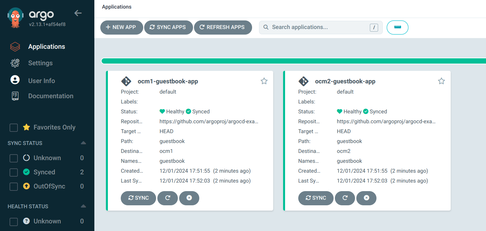

## Integrating ArgoCD with Open Cluster Management
- Based on: https://open-cluster-management.io/docs/scenarios/integration-with-argocd/
- These steps are based on the assumptions that both OCM and ArgoCD have been installed successfully (see [argocd.md](argocd.md) and [ocm.md](ocm.md))

- Create config map for OCM placement generator
```
cat << EOF | kubectl apply -f -
apiVersion: v1
kind: ConfigMap
metadata:
  name: ocm-placement-generator
  namespace: argocd
data:
  apiVersion: cluster.open-cluster-management.io/v1beta1
  kind: placementdecisions
  statusListKey: decisions
  matchKey: clusterName
EOF
```
- Grant ArgoCD permissions to access OCM resources
```
cat << EOF | kubectl apply -f -
apiVersion: rbac.authorization.k8s.io/v1
kind: Role
metadata:
  name: ocm-placement-consumer
  namespace: argocd
rules:
- apiGroups: ["cluster.open-cluster-management.io"]
  resources: ["placementdecisions"]
  verbs: ["get", "list"]

---
apiVersion: rbac.authorization.k8s.io/v1
kind: RoleBinding
metadata:
  name: ocm-placement-consumer:argocd
  namespace: argocd
roleRef:
  apiGroup: rbac.authorization.k8s.io
  kind: Role
  name: ocm-placement-consumer
subjects:
- kind: ServiceAccount
  namespace: argocd
  name: argocd-applicationset-controller
EOF
```
- Bind an OCM managedclusterset to argocd namespace
```
ubuntu@ocmhub:~$ clusteradm get clustersets
<ManagedClusterSet> 
└── <default> 
│   ├── <BoundNamespace> 
│   ├── <Status> No ManagedCluster selected
│   ├── <Clusters> []
└── <global> 
│   ├── <Status> 2 ManagedClusters selected
│   ├── <Clusters> [ocm1 ocm2]
│   ├── <BoundNamespace> 
└── <satcu> 
    └── <Clusters> [ocm1 ocm2]
    └── <BoundNamespace> default
    └── <Status> 2 ManagedClusters selected
ubuntu@ocmhub:~$ clusteradm get clusters
<ManagedCluster> 
└── <ocm1> 
│   ├── <ClusterSet> satcu
│   ├── <KubernetesVersion> v1.30.6+k3s1
│   ├── <Capacity> 
│   │   ├── <Memory> 4004652Ki
│   │   ├── <Cpu> 1
│   ├── <Accepted> true
│   ├── <Available> True
└── <ocm2> 
    └── <ClusterSet> satcu
    └── <KubernetesVersion> v1.30.6+k3s1
    └── <Capacity> 
    │   ├── <Cpu> 1
    │   ├── <Memory> 4004648Ki
    └── <Accepted> true
    └── <Available> True
ubuntu@ocmhub:~$ 
ubuntu@ocmhub:~$ clusteradm clusterset bind satcu --namespace argocd
Clusterset satcu is bound to Namespace argocd
ubuntu@ocmhub:~$ 
```
- Create a placement in argocd namespace to select some clusters
```
cat << EOF | kubectl apply -f -
apiVersion: cluster.open-cluster-management.io/v1beta1
kind: Placement
metadata:
  name: guestbook-app-placement
  namespace: argocd
spec:
  numberOfClusters: 2
EOF
```
- Check the placement status
```
ubuntu@ocmhub:~$ kubectl get placement
NAME                      SUCCEEDED   REASON                  SELECTEDCLUSTERS
guestbook-app-placement   True        AllDecisionsScheduled   2

ubuntu@ocmhub:~$ kubectl describe placement guestbook-app-placement
Name:         guestbook-app-placement
Namespace:    argocd
Labels:       <none>
Annotations:  <none>
API Version:  cluster.open-cluster-management.io/v1beta1
Kind:         Placement
Metadata:
  Creation Timestamp:  2024-12-01T23:48:40Z
  Generation:          1
  Resource Version:    38234
  UID:                 9863c538-bfb0-4c5c-a0f1-bce46d814e44
Spec:
  Number Of Clusters:  2
Status:
  Conditions:
    Last Transition Time:  2024-12-01T23:48:40Z
    Message:               Placement configurations check pass
    Reason:                Succeedconfigured
    Status:                False
    Type:                  PlacementMisconfigured
    Last Transition Time:  2024-12-01T23:48:40Z
    Message:               All cluster decisions scheduled
    Reason:                AllDecisionsScheduled
    Status:                True
    Type:                  PlacementSatisfied
  Decision Groups:
    Cluster Count:         2
    Decision Group Index:  0
    Decision Group Name:   
    Decisions:
      guestbook-app-placement-decision-1
  Number Of Selected Clusters:  2
Events:
  Type    Reason          Age                From                  Message
  ----    ------          ----               ----                  -------
  Normal  DecisionCreate  30s                placement-controller  Decision guestbook-app-placement-decision-1 is created with placement guestbook-app-placement in namespace argocd
  Normal  DecisionUpdate  30s                placement-controller  Decision guestbook-app-placement-decision-1 is updated with placement guestbook-app-placement in namespace argocd
  Normal  ScoreUpdate     30s                placement-controller  ocm2:0 ocm1:0
  Normal  DecisionUpdate  30s (x2 over 30s)  placement-controller  Decision guestbook-app-placement-decision-1 is updated with placement guestbook-app-placement in namespace argocd
  Normal  ScoreUpdate     30s (x2 over 30s)  placement-controller  ocm1:0 ocm2:0
ubuntu@ocmhub:~$ 

ubuntu@ocmhub:~$ kubectl get placementdecision
NAME                                 AGE
guestbook-app-placement-decision-1   106s
ubuntu@ocmhub:~$ kubectl describe placementdecision guestbook-app-placement-decision-1
Name:         guestbook-app-placement-decision-1
Namespace:    argocd
Labels:       cluster.open-cluster-management.io/decision-group-index=0
              cluster.open-cluster-management.io/decision-group-name=
              cluster.open-cluster-management.io/placement=guestbook-app-placement
Annotations:  <none>
API Version:  cluster.open-cluster-management.io/v1beta1
Kind:         PlacementDecision
Metadata:
  Creation Timestamp:  2024-12-01T23:48:40Z
  Generation:          1
  Owner References:
    API Version:           cluster.open-cluster-management.io/v1beta1
    Block Owner Deletion:  true
    Controller:            true
    Kind:                  Placement
    Name:                  guestbook-app-placement
    UID:                   9863c538-bfb0-4c5c-a0f1-bce46d814e44
  Resource Version:        38232
  UID:                     5c8943d6-1258-4a5c-8fad-450a5e403e5b
Status:
  Decisions:
    Cluster Name:  ocm1
    Reason:        
    Cluster Name:  ocm2
    Reason:        
Events:            <none>
ubuntu@ocmhub:~$ 
```
- Create an ArgoCD application set
```
cat << EOF | kubectl apply -f -
apiVersion: argoproj.io/v1alpha1
kind: ApplicationSet
metadata:
  name: guestbook-app
  namespace: argocd
spec:
  generators:
    - clusterDecisionResource:
        configMapRef: ocm-placement-generator
        labelSelector:
          matchLabels:
            cluster.open-cluster-management.io/placement: guestbook-app-placement
        requeueAfterSeconds: 30
  template:
    metadata:
      name: '{{clusterName}}-guestbook-app'
    spec:
      project: default
      source:
        repoURL: 'https://github.com/argoproj/argocd-example-apps.git'
        targetRevision: HEAD
        path: guestbook
      destination:
        name: '{{clusterName}}'
        namespace: guestbook
      syncPolicy:
        automated:
          prune: true
        syncOptions:
          - CreateNamespace=true
EOF
```
- Check the status
```
ubuntu@ocmhub:~$ kubectl -n argocd get applicationsets
NAME            AGE
guestbook-app   38s
ubuntu@ocmhub:~$ kubectl -n argocd get applications
NAME                 SYNC STATUS   HEALTH STATUS
ocm1-guestbook-app   Synced        Healthy
ocm2-guestbook-app   Synced        Healthy
ubuntu@ocmhub:~$ 
```
- Check on the individual cluster, make sure the app is running
```
ubuntu@ocm1:~$ kubectl get po -n guestbook
NAME                            READY   STATUS    RESTARTS   AGE
guestbook-ui-649789b49c-vj8hr   1/1     Running   0          104s
ubuntu@ocm1:~$ 

ubuntu@ocm2:~$ kubectl get po -n guestbook
NAME                            READY   STATUS    RESTARTS   AGE
guestbook-ui-649789b49c-h6lb8   1/1     Running   0          5m51s
ubuntu@ocm2:~$ 
```
The ArgoCD UI should also show the apps

